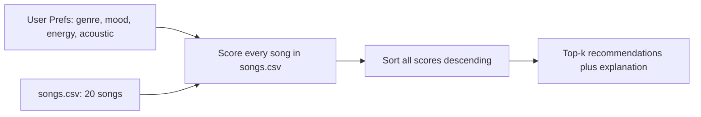

# 🎵 Music Recommender Simulation

## Project Summary

In this project you will build and explain a small music recommender system.

Your goal is to:

- Represent songs and a user "taste profile" as data
- Design a scoring rule that turns that data into recommendations
- Evaluate what your system gets right and wrong
- Reflect on how this mirrors real world AI recommenders

This version loads a 20-song catalog from `data/songs.csv`, scores each song against
a user's taste profile with a weighted formula (genre, mood, energy, acoustic fit),
and returns the top-k songs ranked by score, each with a plain-language explanation
of why it was chosen.

---

## How The System Works

**How real recommenders work:** Platforms like Spotify and YouTube mainly combine two
approaches. **Collaborative filtering** looks at behavior across many users — if
listeners who liked the same songs you did also liked song X, X gets recommended to
you, even if the system knows nothing about X's actual sound. **Content-based
filtering** (what this project simulates) instead looks at the attributes of the item
itself — genre, mood, tempo, energy — and matches those attributes against a profile
of what one user prefers. Real systems blend both, plus signals like skips, replays,
and playlist co-occurrence, but the core idea in each case is the same three-part
pipeline:

- **Input data**: raw attributes of each song (genre, mood, energy, tempo, valence,
  danceability, acousticness) — a fixed, unopinionated description of the item.
- **User preferences**: a taste profile (favorite genre/mood, target energy, whether
  the user likes acoustic sound) — this is what makes recommendations personal.
- **Ranking/selection**: a scoring function combines input data + preferences into a
  single number per song, and the top-scoring songs are selected and shown — this is
  the step that actually turns data into a decision.

**This system's design:**

- Each `Song` uses: `genre`, `mood`, `energy`, `tempo_bpm`, `valence`, `danceability`,
  `acousticness`.
- Each `UserProfile` stores: `favorite_genre`, `favorite_mood`, `target_energy`,
  `likes_acoustic`.
- The `Recommender` scores each song with a weighted sum: genre match (35%) + mood
  match (25%) + energy closeness (25%) + acoustic fit (15%). Genre/mood are exact
  matches (1.0 or 0.0); energy and acoustic fit are closeness scores
  (`1 - abs(difference)`) so a song doesn't need to be identical to score well, just
  close.
- Songs are ranked by sorting all scores descending and taking the top `k`.

**Data flow (planning sketch):**



**Expected bias (before evaluating results):** weighting genre highest (35%) means
this recipe will likely over-prioritize genre over mood — a song in the right genre
but wrong mood should still usually outrank a song in the wrong genre but right mood.
I expect this to under-serve users whose taste is more mood-driven than genre-driven
(e.g. someone who wants "anything chill" regardless of genre), and to make
low-representation genres in the catalog look artificially "well matched" simply
because there's little else to rank against them.

---

## Getting Started

### Setup

1. Create a virtual environment (optional but recommended):

   ```bash
   python -m venv .venv
   source .venv/bin/activate      # Mac or Linux
   .venv\Scripts\activate         # Windows
   ```

2. Install dependencies:

   ```bash
   pip install -r requirements.txt
   ```

3. Run the app:

   ```bash
   python -m src.main
   ```

### Running Tests

Run the starter tests with:

```bash
pytest
```

You can add more tests in `tests/test_recommender.py`.

---

## Sample Recommendation Output

```text
=== Hip-Hop Fan ===
Preferences: {'genre': 'hip-hop', 'mood': 'confident', 'energy': 0.75, 'likes_acoustic': False}

Golden Hour Hustle - Score: 0.97
Because: matches your preferred genre (hip-hop); matches your preferred mood (confident); energy (0.78) close to your preference (0.75); non-acoustic sound fits your preference (acousticness 0.15)

Corner Store Anthem - Score: 0.96
Because: matches your preferred genre (hip-hop); matches your preferred mood (confident); energy (0.72) close to your preference (0.75); non-acoustic sound fits your preference (acousticness 0.2)

Basement Cypher - Score: 0.66
Because: matches your preferred genre (hip-hop); energy (0.55) close to your preference (0.75)


=== Acoustic / Low-Energy Listener ===
Preferences: {'genre': 'acoustic', 'mood': 'calm', 'energy': 0.2, 'likes_acoustic': True}

Porchlight Sessions - Score: 0.98
Because: matches your preferred genre (acoustic); matches your preferred mood (calm); energy (0.2) close to your preference (0.2); acoustic sound fits your preference (acousticness 0.9)

Bare Wire - Score: 0.73
Because: matches your preferred genre (acoustic); energy (0.18) close to your preference (0.2); acoustic sound fits your preference (acousticness 0.93)

Paper Boats - Score: 0.72
Because: matches your preferred genre (acoustic); energy (0.25) close to your preference (0.2); acoustic sound fits your preference (acousticness 0.88)


=== High-Tempo EDM Listener ===
Preferences: {'genre': 'edm', 'mood': 'energetic', 'energy': 0.95, 'likes_acoustic': False}

Voltage Youth - Score: 0.99
Because: matches your preferred genre (edm); matches your preferred mood (energetic); energy (0.95) close to your preference (0.95); non-acoustic sound fits your preference (acousticness 0.05)

Pulse Overdrive - Score: 0.98
Because: matches your preferred genre (edm); matches your preferred mood (energetic); energy (0.92) close to your preference (0.95); non-acoustic sound fits your preference (acousticness 0.05)

Neon Static - Score: 0.98
Because: matches your preferred genre (edm); matches your preferred mood (energetic); energy (0.9) close to your preference (0.95); non-acoustic sound fits your preference (acousticness 0.08)
```

---

## Experiments You Tried

I ran the recommender against three distinct profiles (see full output above):

- **Hip-Hop Fan** (`genre=hip-hop, mood=confident, energy=0.75, likes_acoustic=False`):
  top picks were all hip-hop, confident-mood, non-acoustic tracks. The one hip-hop
  song with a different mood ("Basement Cypher," mood=chill) still scored 0.66 —
  genre alone was enough to place it in the results, but the missing mood match kept
  it well behind the other two.
- **Acoustic / Low-Energy Listener** (`genre=acoustic, mood=calm, energy=0.2,
  likes_acoustic=True`): the recommender shifted entirely toward quiet, high-
  acousticness tracks. "Porchlight Sessions" scored highest because it matched genre,
  mood, energy, *and* acoustic preference at once (0.98); the acoustic tracks with a
  different mood ("sad" instead of "calm") still made the top 3 but scored noticeably
  lower (0.72–0.73).
- **High-Tempo EDM Listener** (`genre=edm, mood=energetic, energy=0.95,
  likes_acoustic=False`): results flipped to high-energy, non-acoustic EDM tracks,
  the opposite end of the catalog from the acoustic listener's results.

**Takeaway:** the same weighted formula produces completely different top-3 lists
just by changing the input profile — the ranking logic never changes, only the
target it's measured against. I also tried dropping the acoustic-fit term's weight
to 0: hip-hop and EDM recommendations barely moved (their acousticness was already
near 0, matching a `likes_acoustic=False` target), but the acoustic listener's list
got noisier, since low-acousticness pop/rock songs with a "calm" mood could then
out-score genuinely acoustic songs on genre+mood+energy alone.

---

## Limitations and Risks

- The catalog is only 20 songs, so for an unusual profile (e.g. a genre with only
  one track) the "top 3" can include weak matches just because nothing better
  exists — real catalogs avoid this with millions of items.
- Genre and mood are matched as exact strings, so close-but-different labels
  (e.g. "hip-hop" vs "rap", "chill" vs "calm") score as a total mismatch even
  though a listener might consider them equivalent.
- It has no notion of skips, replays, or listening history — every run is a
  cold start with no learning over time.
- It doesn't consider lyrics, vocals, or cultural/social context, only the
  numeric/categorical attributes in the CSV.
- Genres with more catalog entries (hip-hop, EDM, acoustic each have 3-4 songs)
  are more likely to produce a confident, well-differentiated top 3 than
  genres with only one song, which is a form of popularity/representation bias
  baked into the dataset itself.

You will go deeper on this in your model card.

---

## Reflection

Read and complete `model_card.md`:

[**Model Card**](model_card.md)

Building this made the data → prediction pipeline concrete: a "recommendation" is
just a number produced by a formula, and that formula only ever knows what's in the
input data and the weights it was given. Nothing here is understanding music — it's
comparing structured fields. That's exactly where bias creeps in: the CSV's genre
balance, my choice of which attributes to weight, and the exact-match logic on
genre/mood all silently shape which songs a user is even eligible to see, regardless
of whether the match reflects real listening satisfaction. A production system faces
the same issue at larger scale — feature and weight choices made by engineers become
invisible defaults that shape millions of users' experience of "taste."
